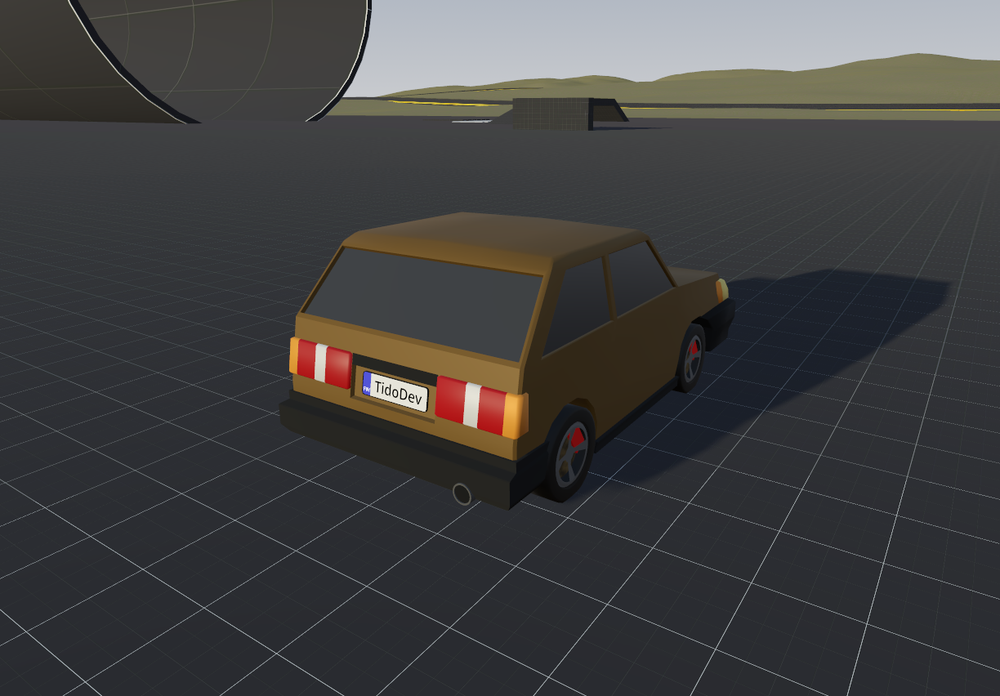
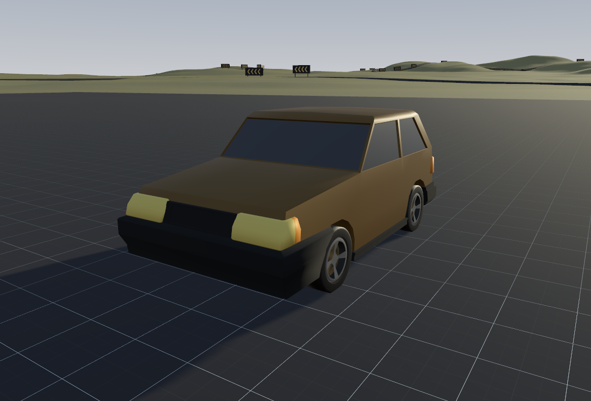

# Godot Custom Vehicle GD

A custom vehicle physics project built in Godot 4.6 using GDScript. Also [in C#](https://github.com/thetidodev/custom-vehicle-cs)

[Showcase video](https://youtube.com)

## Based On

https://github.com/jreo03/g4-svd

## NOTES

Please replace/delete assets referred in borrowed_assets.txt when publishing your game using this project.  
Feel free to use any of the meshes in any project for any purpose, even commercially. idk why you would want to do that but go ahead.

## Controls

### Keyboard

| Action          | Key(s)             |
| --------------- | ------------------ |
| Throttle        | W                  |
| Brake / Reverse | S                  |
| Steer Left      | A                  |
| Steer Right     | D                  |
| Gear Up         | E / G / Arrow UP   |
| Gear Down       | Q / B / Arrow Down |
| Handbrake       | Space              |
| Clutch          | Left Shift         |
| Toggle Camera   | V                  |
| Debug           | C                  |
| Mouse lock      | Escape             |

### Gamepad (Xbox / PlayStation layout)

| Action        | Input                    |
| ------------- | ------------------------ |
| Throttle      | Right Trigger (RT / R2)  |
| Brake         | Left Trigger (LT / L2)   |
| Steer         | Left Stick               |
| Camera        | Right Stick              |
| Gear Up       | A / Cross                |
| Gear Down     | X / Square               |
| Handbrake     | Right Shoulder (RB / R1) |
| Clutch        | Left Shoulder (LB / L1)  |
| Toggle Camera | B / Circle               |
